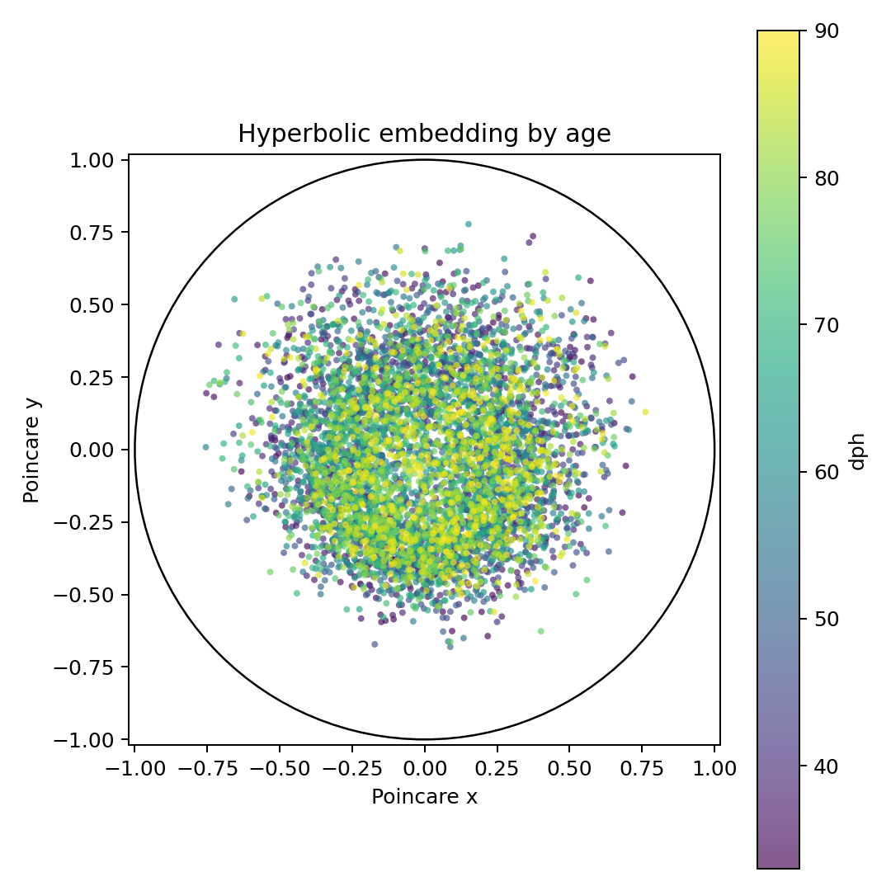
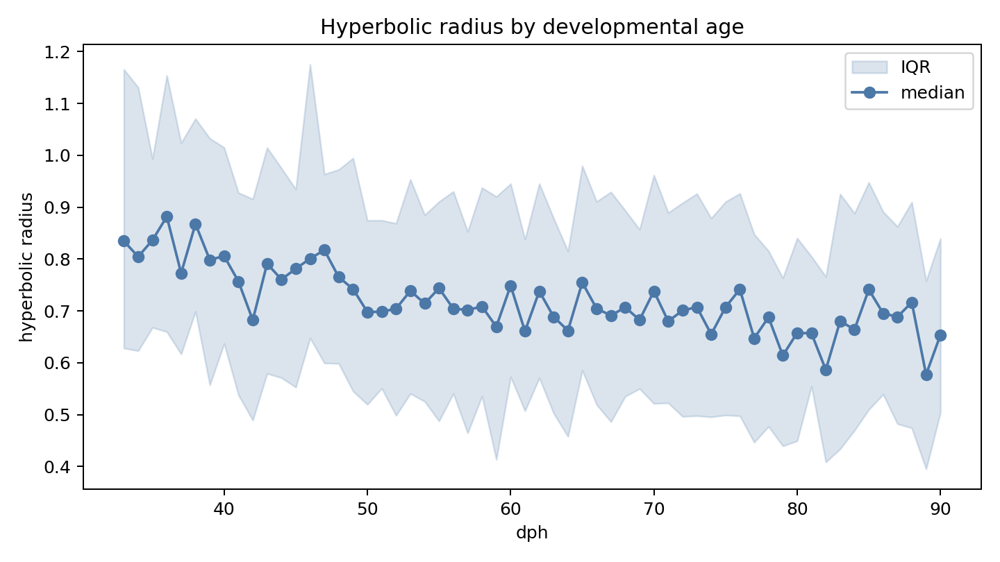
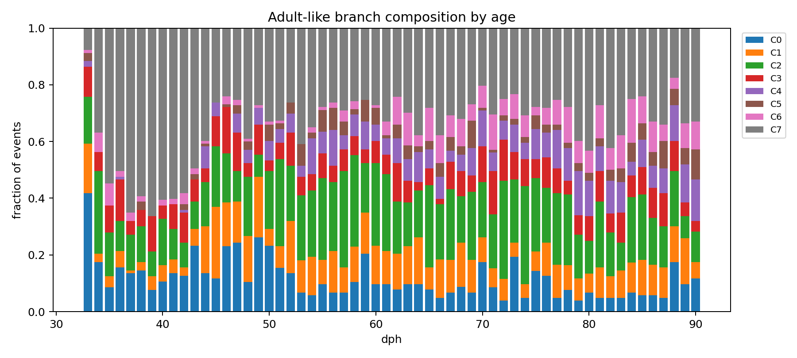
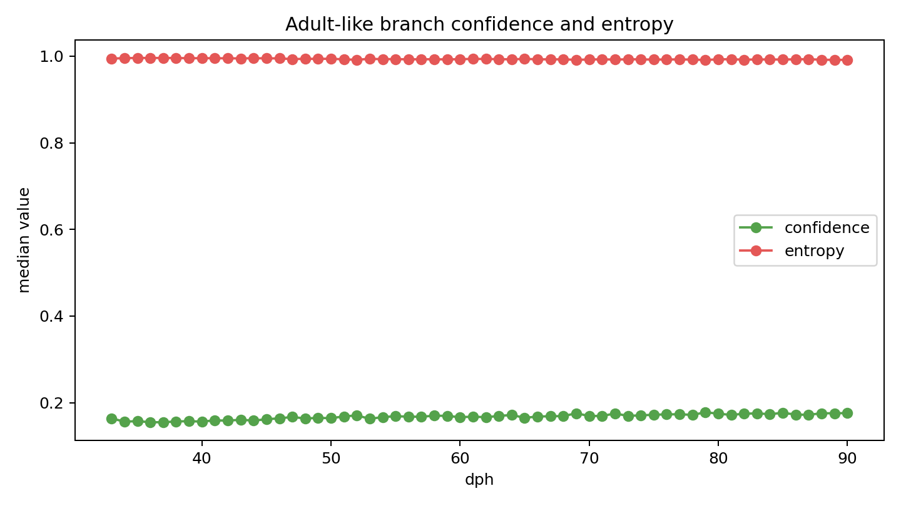
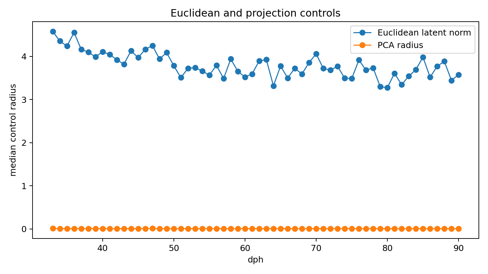

# Hyperbolic Developmental AVA Report

## Summary

- Events sampled: 114690 of 2348764 available ROI events.
- Primary radius-age Spearman rho: -0.743 (p=2.38e-11, bootstrap CI [-0.853, -0.564]).
- Adult-like clusters: K=8 from 22000 late-age events.
- Adult-cluster confidence-age Spearman rho: 0.921 (bootstrap CI [0.858, 0.953]); entropy-age rho: -0.817 (bootstrap CI [-0.909, -0.645]).
- Early/late medians: radius 0.7997 -> 0.6617; confidence 0.1582 -> 0.1742; entropy 0.9953 -> 0.9923.
- Sensitivity run: rho=-0.700, CI=[-0.826697746767526, -0.5035381640693568].

## Figures











## Interpretation

The primary radius-age test does not support the current hyperbolic developmental hypothesis in this run.

Late events are more confidently assigned to adult-like branches and have lower cluster entropy, but they are not more distal by the primary hyperbolic radius coordinate.

## Skip And Coverage Summary

```json
{
  "bird_id": "PK249",
  "by_dph": {
    "33": {
      "clips_missing_latent": 2,
      "clips_missing_roi": 5,
      "clips_seen": 140,
      "events_available": 690,
      "events_sampled": 690,
      "roi_events_total": 834,
      "roi_events_without_windows": 144,
      "roi_parse_errors": 0
    },
    "34": {
      "clips_missing_latent": 0,
      "clips_missing_roi": 0,
      "clips_seen": 328,
      "events_available": 3334,
      "events_sampled": 2000,
      "roi_events_total": 3722,
      "roi_events_without_windows": 388,
      "roi_parse_errors": 0
    },
    "35": {
      "clips_missing_latent": 0,
      "clips_missing_roi": 11,
      "clips_seen": 471,
      "events_available": 4792,
      "events_sampled": 2000,
      "roi_events_total": 5225,
      "roi_events_without_windows": 433,
      "roi_parse_errors": 0
    },
    "36": {
      "clips_missing_latent": 3,
      "clips_missing_roi": 1,
      "clips_seen": 764,
      "events_available": 15318,
      "events_sampled": 2000,
      "roi_events_total": 21096,
      "roi_events_without_windows": 5778,
      "roi_parse_errors": 0
    },
    "37": {
      "clips_missing_latent": 1,
      "clips_missing_roi": 3,
      "clips_seen": 592,
      "events_available": 7687,
      "events_sampled": 2000,
      "roi_events_total": 8211,
      "roi_events_without_windows": 524,
      "roi_parse_errors": 0
    },
    "38": {
      "clips_missing_latent": 3,
      "clips_missing_roi": 9,
      "clips_seen": 1538,
      "events_available": 22734,
      "events_sampled": 2000,
      "roi_events_total": 24596,
      "roi_events_without_windows": 1862,
      "roi_parse_errors": 0
    },
    "39": {
      "clips_missing_latent": 1,
      "clips_missing_roi": 3,
      "clips_seen": 2121,
      "events_available": 26388,
      "events_sampled": 2000,
      "roi_events_total": 28966,
      "roi_events_without_windows": 2578,
      "roi_parse_errors": 0
    },
    "40": {
      "clips_missing_latent": 1,
      "clips_missing_roi": 7,
      "clips_seen": 2467,
      "events_available": 37126,
      "events_sampled": 2000,
      "roi_events_total": 38995,
      "roi_events_without_windows": 1869,
      "roi_parse_errors": 0
    },
    "41": {
      "clips_missing_latent": 0,
      "clips_missing_roi": 5,
      "clips_seen": 2248,
      "events_available": 29458,
      "events_sampled": 2000,
      "roi_events_total": 31294,
      "roi_events_without_windows": 1836,
      "roi_parse_errors": 0
    },
    "42": {
      "clips_missing_latent": 1,
      "clips_missing_roi": 4,
      "clips_seen": 2005,
      "events_available": 37644,
      "events_sampled": 2000,
      "roi_events_total": 51834,
      "roi_events_without_windows": 14190,
      "roi_parse_errors": 0
    },
    "43": {
      "clips_missing_latent": 0,
      "clips_missing_roi": 5,
      "clips_seen": 1658,
      "events_available": 26702,
      "events_sampled": 2000,
      "roi_events_total": 32877,
      "roi_events_without_windows": 6175,
      "roi_parse_errors": 0
    },
    "44": {
      "clips_missing_latent": 0,
      "clips_missing_roi": 3,
      "clips_seen": 1838,
      "events_available": 33131,
      "events_sampled": 2000,
      "roi_events_total": 35026,
      "roi_events_without_windows": 1895,
      "roi_parse_errors": 0
    },
    "45": {
      "clips_missing_latent": 4,
      "clips_missing_roi": 8,
      "clips_seen": 2267,
      "events_available": 42784,
      "events_sampled": 2000,
      "roi_events_total": 46018,
      "roi_events_without_windows": 3234,
      "roi_parse_errors": 0
    },
    "46": {
      "clips_missing_latent": 1,
      "clips_missing_roi": 3,
      "clips_seen": 1475,
      "events_available": 70604,
      "events_sampled": 2000,
      "roi_events_total": 117184,
      "roi_events_without_windows": 46580,
      "roi_parse_errors": 0
    },
    "47": {
      "clips_missing_latent": 0,
      "clips_missing_roi": 3,
      "clips_seen": 1731,
      "events_available": 43169,
      "events_sampled": 2000,
      "roi_events_total": 54566,
      "roi_events_without_windows": 11397,
      "roi_parse_errors": 0
    },
    "48": {
      "clips_missing_latent": 0,
      "clips_missing_roi": 4,
      "clips_seen": 1468,
      "events_available": 36136,
      "events_sampled": 2000,
      "roi_events_total": 38293,
      "roi_events_without_windows": 2157,
      "roi_parse_errors": 0
    },
    "49": {
      "clips_missing_latent": 0,
      "clips_missing_roi": 6,
      "clips_seen": 1324,
      "events_available": 41334,
      "events_sampled": 2000,
      "roi_events_total": 60635,
      "roi_events_without_windows": 19301,
      "roi_parse_errors": 0
    },
    "50": {
      "clips_missing_latent": 0,
      "clips_missing_roi": 3,
      "clips_seen": 1439,
      "events_available": 40264,
      "events_sampled": 2000,
      "roi_events_total": 52657,
      "roi_events_without_windows": 12393,
      "roi_parse_errors": 0
    },
    "51": {
      "clips_missing_latent": 1,
      "clips_missing_roi": 6,
      "clips_seen": 1709,
      "events_available": 34864,
      "events_sampled": 2000,
      "roi_events_total": 38696,
      "roi_events_without_windows": 3832,
      "roi_parse_errors": 0
    },
    "52": {
      "clips_missing_latent": 1,
      "clips_missing_roi": 5,
      "clips_seen": 1727,
      "events_available": 39595,
      "events_sampled": 2000,
      "roi_events_total": 43605,
      "roi_events_without_windows": 4010,
      "roi_parse_errors": 0
    },
    "53": {
      "clips_missing_latent": 0,
      "clips_missing_roi": 1,
      "clips_seen": 1619,
      "events_available": 37837,
      "events_sampled": 2000,
      "roi_events_total": 41544,
      "roi_events_without_windows": 3707,
      "roi_parse_errors": 0
    },
    "54": {
      "clips_missing_latent": 0,
      "clips_missing_roi": 5,
      "clips_seen": 1898,
      "events_available": 46262,
      "events_sampled": 2000,
      "roi_events_total": 49813,
      "roi_events_without_windows": 3551,
      "roi_parse_errors": 0
    },
    "55": {
      "clips_missing_latent": 0,
      "clips_missing_roi": 4,
      "clips_seen": 1811,
      "events_available": 44444,
      "events_sampled": 2000,
      "roi_events_total": 49000,
      "roi_events_without_windows": 4556,
      "roi_parse_errors": 0
    },
    "56": {
      "clips_missing_latent": 0,
      "clips_missing_roi": 4,
      "clips_seen": 1969,
      "events_available": 49984,
      "events_sampled": 2000,
      "roi_events_total": 55180,
      "roi_events_without_windows": 5196,
      "roi_parse_errors": 0
    },
    "57": {
      "clips_missing_latent": 1,
      "clips_missing_roi": 3,
      "clips_seen": 1961,
      "events_available": 50159,
      "events_sampled": 2000,
      "roi_events_total": 54803,
      "roi_events_without_windows": 4644,
      "roi_parse_errors": 0
    },
    "58": {
      "clips_missing_latent": 0,
      "clips_missing_roi": 9,
      "clips_seen": 1996,
      "events_available": 48540,
      "events_sampled": 2000,
      "roi_events_total": 52790,
      "roi_events_without_windows": 4250,
      "roi_parse_errors": 0
    },
    "59": {
      "clips_missing_latent": 1,
      "clips_missing_roi": 4,
      "clips_seen": 1711,
      "events_available": 39889,
      "events_sampled": 2000,
      "roi_events_total": 43690,
      "roi_events_without_windows": 3801,
      "roi_parse_errors": 0
    },
    "60": {
      "clips_missing_latent": 3,
      "clips_missing_roi": 3,
      "clips_seen": 2037,
      "events_available": 51864,
      "events_sampled": 2000,
      "roi_events_total": 58739,
      "roi_events_without_windows": 6875,
      "roi_parse_errors": 0
    },
    "61": {
      "clips_missing_latent": 0,
      "clips_missing_roi": 3,
      "clips_seen": 1941,
      "events_available": 46754,
      "events_sampled": 2000,
      "roi_events_total": 50738,
      "roi_events_without_windows": 3984,
      "roi_parse_errors": 0
    },
    "62": {
      "clips_missing_latent": 0,
      "clips_missing_roi": 2,
      "clips_seen": 1995,
      "events_available": 49204,
      "events_sampled": 2000,
      "roi_events_total": 54216,
      "roi_events_without_windows": 5012,
      "roi_parse_errors": 0
    },
    "63": {
      "clips_missing_latent": 1,
      "clips_missing_roi": 0,
      "clips_seen": 1713,
      "events_available": 46640,
      "events_sampled": 2000,
      "roi_events_total": 51058,
      "roi_events_without_windows": 4418,
      "roi_parse_errors": 0
    },
    "64": {
      "clips_missing_latent": 1,
      "clips_missing_roi": 4,
      "clips_seen": 1991,
      "events_available": 47267,
      "events_sampled": 2000,
      "roi_events_total": 50001,
      "roi_events_without_windows": 2734,
      "roi_parse_errors": 0
    },
    "65": {
      "clips_missing_latent": 1,
      "clips_missing_roi": 28,
      "clips_seen": 1807,
      "events_available": 46121,
      "events_sampled": 2000,
      "roi_events_total": 49999,
      "roi_events_without_windows": 3878,
      "roi_parse_errors": 0
    },
    "66": {
      "clips_missing_latent": 1,
      "clips_missing_roi": 1,
      "clips_seen": 1803,
      "events_available": 45450,
      "events_sampled": 2000,
      "roi_events_total": 49011,
      "roi_events_without_windows": 3561,
      "roi_parse_errors": 0
    },
    "67": {
      "clips_missing_latent": 0,
      "clips_missing_roi": 0,
      "clips_seen": 2141,
      "events_available": 53866,
      "events_sampled": 2000,
      "roi_events_total": 59391,
      "roi_events_without_windows": 5525,
      "roi_parse_errors": 0
    },
    "68": {
      "clips_missing_latent": 0,
      "clips_missing_roi": 22,
      "clips_seen": 2107,
      "events_available": 47449,
      "events_sampled": 2000,
      "roi_events_total": 58219,
      "roi_events_without_windows": 10770,
      "roi_parse_errors": 0
    },
    "69": {
      "clips_missing_latent": 2,
      "clips_missing_roi": 6,
      "clips_seen": 2032,
      "events_available": 44686,
      "events_sampled": 2000,
      "roi_events_total": 48342,
      "roi_events_without_windows": 3656,
      "roi_parse_errors": 0
    },
    "70": {
      "clips_missing_latent": 4,
      "clips_missing_roi": 6,
      "clips_seen": 1657,
      "events_available": 58484,
      "events_sampled": 2000,
      "roi_events_total": 80859,
      "roi_events_without_windows": 22375,
      "roi_parse_errors": 0
    },
    "71": {
      "clips_missing_latent": 0,
      "clips_missing_roi": 3,
      "clips_seen": 1945,
      "events_available": 53755,
      "events_sampled": 2000,
      "roi_events_total": 64641,
      "roi_events_without_windows": 10886,
      "roi_parse_errors": 0
    },
    "72": {
      "clips_missing_latent": 2,
      "clips_missing_roi": 4,
      "clips_seen": 1921,
      "events_available": 51853,
      "events_sampled": 2000,
      "roi_events_total": 58514,
      "roi_events_without_windows": 6661,
      "roi_parse_errors": 0
    },
    "73": {
      "clips_missing_latent": 0,
      "clips_missing_roi": 2,
      "clips_seen": 1497,
      "events_available": 63998,
      "events_sampled": 2000,
      "roi_events_total": 103002,
      "roi_events_without_windows": 39004,
      "roi_parse_errors": 0
    },
    "74": {
      "clips_missing_latent": 0,
      "clips_missing_roi": 2,
      "clips_seen": 1774,
      "events_available": 51650,
      "events_sampled": 2000,
      "roi_events_total": 57140,
      "roi_events_without_windows": 5490,
      "roi_parse_errors": 0
    },
    "75": {
      "clips_missing_latent": 1,
      "clips_missing_roi": 5,
      "clips_seen": 1568,
      "events_available": 52296,
      "events_sampled": 2000,
      "roi_events_total": 67368,
      "roi_events_without_windows": 15072,
      "roi_parse_errors": 0
    },
    "76": {
      "clips_missing_latent": 2,
      "clips_missing_roi": 5,
      "clips_seen": 1760,
      "events_available": 47520,
      "events_sampled": 2000,
      "roi_events_total": 54723,
      "roi_events_without_windows": 7203,
      "roi_parse_errors": 0
    },
    "77": {
      "clips_missing_latent": 0,
      "clips_missing_roi": 2,
      "clips_seen": 1769,
      "events_available": 48991,
      "events_sampled": 2000,
      "roi_events_total": 54507,
      "roi_events_without_windows": 5516,
      "roi_parse_errors": 0
    },
    "78": {
      "clips_missing_latent": 1,
      "clips_missing_roi": 2,
      "clips_seen": 1573,
      "events_available": 44286,
      "events_sampled": 2000,
      "roi_events_total": 48429,
      "roi_events_without_windows": 4143,
      "roi_parse_errors": 0
    },
    "79": {
      "clips_missing_latent": 0,
      "clips_missing_roi": 6,
      "clips_seen": 1071,
      "events_available": 23635,
      "events_sampled": 2000,
      "roi_events_total": 25844,
      "roi_events_without_windows": 2209,
      "roi_parse_errors": 0
    },
    "80": {
      "clips_missing_latent": 1,
      "clips_missing_roi": 2,
      "clips_seen": 1295,
      "events_available": 30738,
      "events_sampled": 2000,
      "roi_events_total": 32787,
      "roi_events_without_windows": 2049,
      "roi_parse_errors": 0
    },
    "81": {
      "clips_missing_latent": 0,
      "clips_missing_roi": 2,
      "clips_seen": 1442,
      "events_available": 33156,
      "events_sampled": 2000,
      "roi_events_total": 36073,
      "roi_events_without_windows": 2917,
      "roi_parse_errors": 0
    },
    "82": {
      "clips_missing_latent": 0,
      "clips_missing_roi": 3,
      "clips_seen": 1437,
      "events_available": 34672,
      "events_sampled": 2000,
      "roi_events_total": 38095,
      "roi_events_without_windows": 3423,
      "roi_parse_errors": 0
    },
    "83": {
      "clips_missing_latent": 3,
      "clips_missing_roi": 16,
      "clips_seen": 1680,
      "events_available": 38654,
      "events_sampled": 2000,
      "roi_events_total": 41070,
      "roi_events_without_windows": 2416,
      "roi_parse_errors": 0
    },
    "84": {
      "clips_missing_latent": 0,
      "clips_missing_roi": 2,
      "clips_seen": 1585,
      "events_available": 43258,
      "events_sampled": 2000,
      "roi_events_total": 47389,
      "roi_events_without_windows": 4131,
      "roi_parse_errors": 0
    },
    "85": {
      "clips_missing_latent": 3,
      "clips_missing_roi": 3,
      "clips_seen": 1789,
      "events_available": 48914,
      "events_sampled": 2000,
      "roi_events_total": 54642,
      "roi_events_without_windows": 5728,
      "roi_parse_errors": 0
    },
    "86": {
      "clips_missing_latent": 0,
      "clips_missing_roi": 4,
      "clips_seen": 1572,
      "events_available": 40508,
      "events_sampled": 2000,
      "roi_events_total": 43462,
      "roi_events_without_windows": 2954,
      "roi_parse_errors": 0
    },
    "87": {
      "clips_missing_latent": 1,
      "clips_missing_roi": 3,
      "clips_seen": 1749,
      "events_available": 48611,
      "events_sampled": 2000,
      "roi_events_total": 51778,
      "roi_events_without_windows": 3167,
      "roi_parse_errors": 0
    },
    "88": {
      "clips_missing_latent": 0,
      "clips_missing_roi": 0,
      "clips_seen": 1428,
      "events_available": 67922,
      "events_sampled": 2000,
      "roi_events_total": 104708,
      "roi_events_without_windows": 36786,
      "roi_parse_errors": 0
    },
    "89": {
      "clips_missing_latent": 0,
      "clips_missing_roi": 2,
      "clips_seen": 1667,
      "events_available": 41403,
      "events_sampled": 2000,
      "roi_events_total": 43522,
      "roi_events_without_windows": 2119,
      "roi_parse_errors": 0
    },
    "90": {
      "clips_missing_latent": 1,
      "clips_missing_roi": 2,
      "clips_seen": 1381,
      "events_available": 34290,
      "events_sampled": 2000,
      "roi_events_total": 35912,
      "roi_events_without_windows": 1622,
      "roi_parse_errors": 0
    }
  },
  "clips_missing_latent": 49,
  "clips_missing_roi": 269,
  "clips_seen": 95402,
  "dph_max": 90.0,
  "dph_min": 33.0,
  "entries_selected": 58,
  "events_available": 2348764,
  "events_sampled": 114690,
  "max_events_per_dph": 2000,
  "roi_events_total": 2755329,
  "roi_events_without_windows": 406565,
  "roi_format": "parquet",
  "roi_parse_errors": 0,
  "split": "all"
}
```

## Artifacts

- `event_latents`: `artifacts/autoencoded-vocal-analysis-obi.2/20260507-182654-pk249-hyperbolic-development-autoencoded-vocal-analysis-obi.2/event_latents.parquet`
- `hyperbolic_embedding`: `artifacts/autoencoded-vocal-analysis-obi.2/20260507-182654-pk249-hyperbolic-development-autoencoded-vocal-analysis-obi.2/hyperbolic_embedding.parquet`
- `adult_clusters`: `artifacts/autoencoded-vocal-analysis-obi.2/20260507-182654-pk249-hyperbolic-development-autoencoded-vocal-analysis-obi.2/adult_clusters.json`
- `metrics`: `artifacts/autoencoded-vocal-analysis-obi.2/20260507-182654-pk249-hyperbolic-development-autoencoded-vocal-analysis-obi.2/metrics.json`
