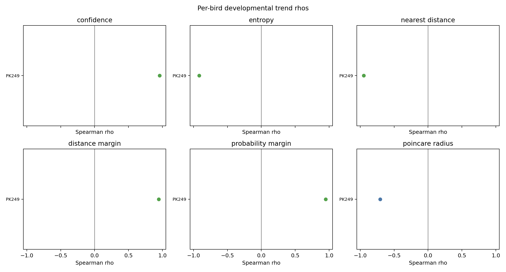
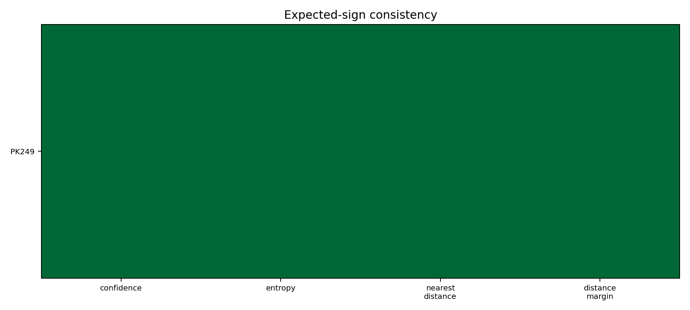
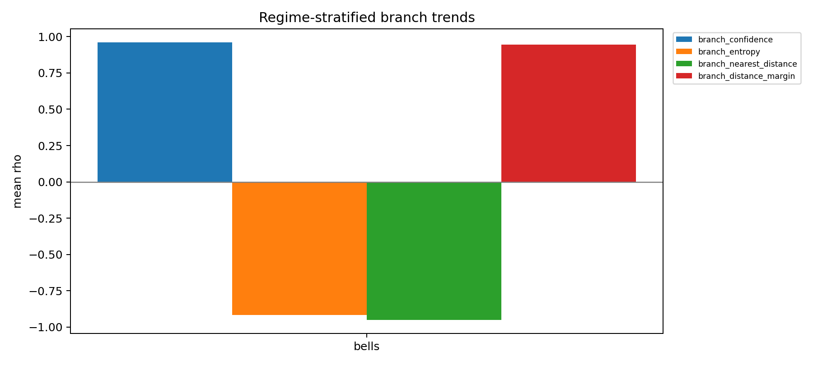
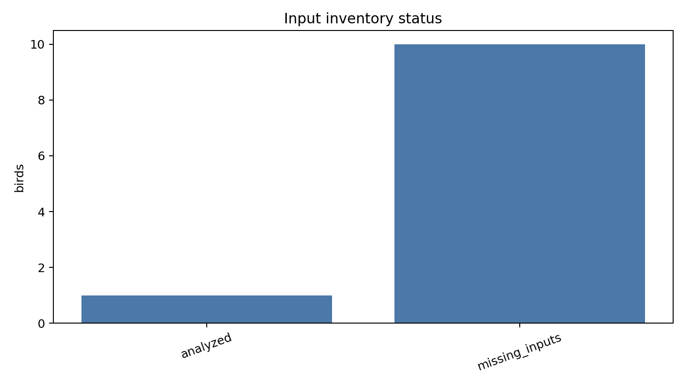

# Multi-Bird Developmental Branch Commitment Replication

## Summary

- Cohort requested: 11 birds (PK249, R426, R467, R404, R150, R493, R470, R203, R425, R229, R122).
- Birds analyzed with local inputs: 1.
- Missing or failed birds: R122, R150, R203, R229, R404, R425, R426, R467, R470, R493.
- Replication success criterion passed: no.
- Branch commitment cannot yet be evaluated against the 9-of-11 replication criterion because local inputs are missing for most birds.
- Optimized Poincare radius is not positive on average, consistent with leaving the hyperbolic VAE gate untriggered.

## Figures

## Cross-Bird Metrics

- `branch_confidence`: mean rho 0.959, CI n/a, expected-sign birds 1 / 1.
- `branch_entropy`: mean rho -0.918, CI n/a, expected-sign birds 1 / 1.
- `branch_nearest_distance`: mean rho -0.949, CI n/a, expected-sign birds 1 / 1.
- `branch_distance_margin`: mean rho 0.944, CI n/a, expected-sign birds 1 / 1.

## Coverage And Bias

Coverage/skips could plausibly bias interpretation for PK249.

`PK249`: skip-filter status computed with 4 excluded dph bins; equalized status computed over 40020 events; all criterion residualized signs match.

## Missing Inputs

- `R122`: No local event_latents.parquet was found and --latent-root was not provided.
- `R150`: No local event_latents.parquet was found and --latent-root was not provided.
- `R203`: No local event_latents.parquet was found and --latent-root was not provided.
- `R229`: No local event_latents.parquet was found and --latent-root was not provided.
- `R404`: No local event_latents.parquet was found and --latent-root was not provided.
- `R425`: No local event_latents.parquet was found and --latent-root was not provided.
- `R426`: No local event_latents.parquet was found and --latent-root was not provided.
- `R467`: No local event_latents.parquet was found and --latent-root was not provided.
- `R470`: No local event_latents.parquet was found and --latent-root was not provided.
- `R493`: No local event_latents.parquet was found and --latent-root was not provided.

## Artifacts

- `cohort`: `artifacts/autoencoded-vocal-analysis-obi.4/20260512-222203-developmental-replication/cohort.json`
- `input_inventory`: `artifacts/autoencoded-vocal-analysis-obi.4/20260512-222203-developmental-replication/input_inventory.json`
- `per_bird_metrics`: `artifacts/autoencoded-vocal-analysis-obi.4/20260512-222203-developmental-replication/per_bird_metrics.json`
- `cross_bird_metrics`: `artifacts/autoencoded-vocal-analysis-obi.4/20260512-222203-developmental-replication/cross_bird_metrics.json`
