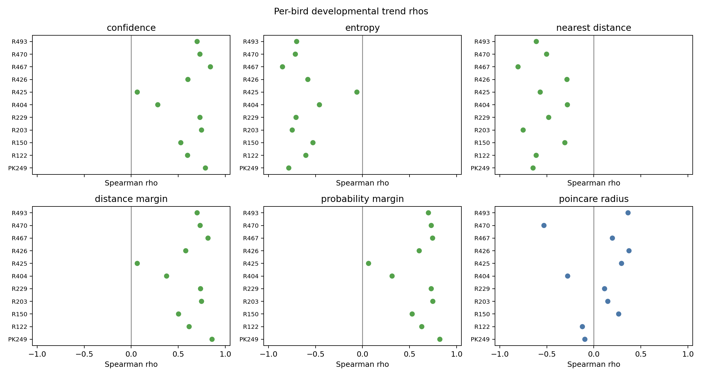
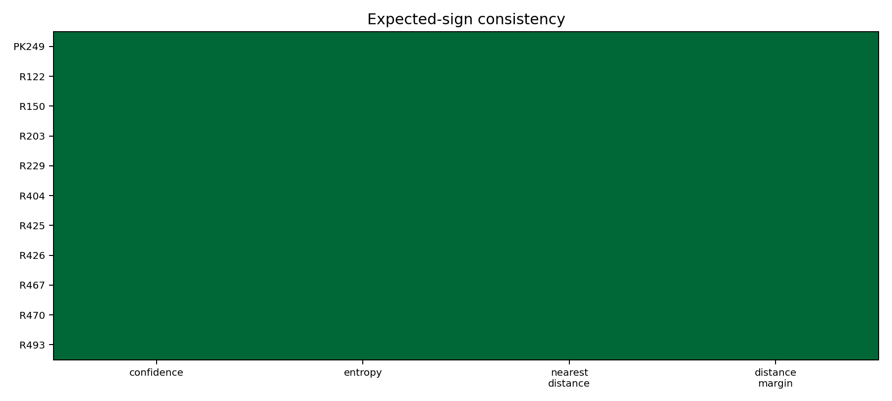
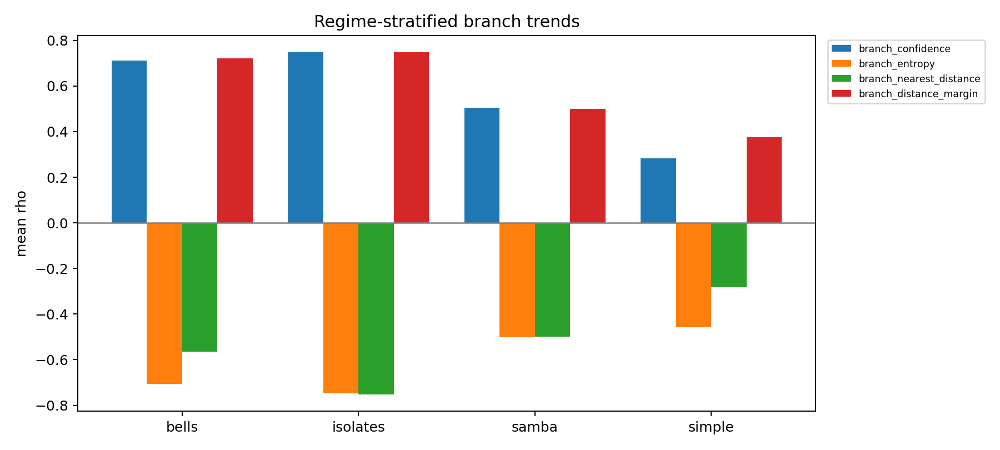
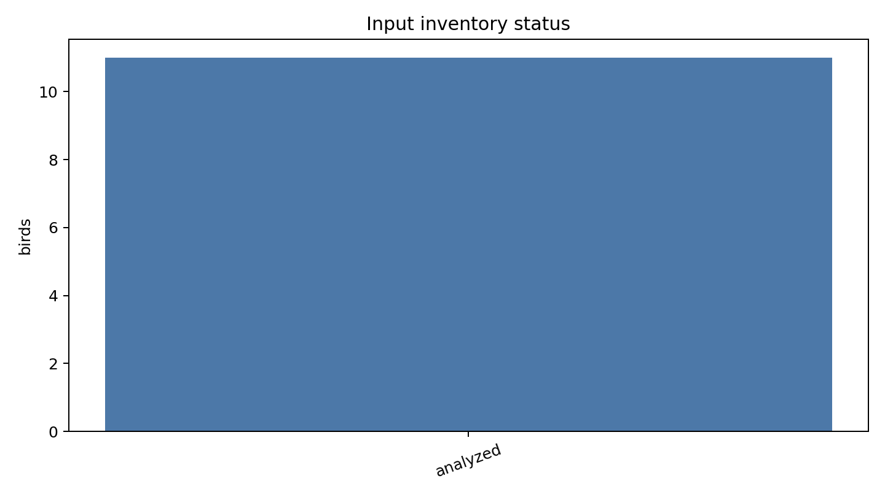

# Multi-Bird Developmental Branch Commitment Replication

## Summary

- Cohort requested: 11 birds (PK249, R426, R467, R404, R150, R493, R470, R203, R425, R229, R122).
- Birds analyzed with local inputs: 11.
- Missing or failed birds: none.
- Replication success criterion passed: yes.
- Branch commitment replicated across the fixed cohort by the prespecified sign and bootstrap criteria.
- Optimized Poincare radius trends positive on average, so the hyperbolic VAE gate remains an open question rather than supported by branch metrics alone.

## Figures

## Cross-Bird Metrics

- `branch_confidence`: mean rho 0.601, CI [0.451, 0.723], expected-sign birds 11 / 11.
- `branch_entropy`: mean rho -0.612, CI [-0.720, -0.473], expected-sign birds 11 / 11.
- `branch_nearest_distance`: mean rho -0.532, CI [-0.637, -0.432], expected-sign birds 11 / 11.
- `branch_distance_margin`: mean rho 0.612, CI [0.468, 0.734], expected-sign birds 11 / 11.

## Coverage And Bias

Coverage/skips could plausibly bias interpretation for PK249, R426, R467, R404, R493, R203, R425.

`PK249`: skip-filter status computed with 4 excluded dph bins; equalized status computed over 40020 events; all criterion residualized signs match. `R426`: skip-filter status computed with 0 excluded dph bins; equalized status computed over 5967 events; residualized signs are incomplete or mixed. `R467`: skip-filter status computed with 1 excluded dph bins; equalized status computed over 53 events; all criterion residualized signs match. `R404`: skip-filter status computed with 0 excluded dph bins; equalized status computed over 58150 events; residualized signs are incomplete or mixed. `R150`: skip-filter status computed with 0 excluded dph bins; equalized status computed over 392 events; all criterion residualized signs match. `R493`: skip-filter status computed with 0 excluded dph bins; equalized status computed over 26544 events; all criterion residualized signs match. `R470`: skip-filter status computed with 0 excluded dph bins; equalized status computed over 4590 events; all criterion residualized signs match. `R203`: skip-filter status computed with 0 excluded dph bins; equalized status computed over 39 events; all criterion residualized signs match. `R425`: skip-filter status computed with 1 excluded dph bins; equalized status computed over 1272 events; residualized signs are incomplete or mixed. `R229`: skip-filter status computed with 0 excluded dph bins; equalized status computed over 9063 events; all criterion residualized signs match. `R122`: skip-filter status computed with 0 excluded dph bins; equalized status computed over 3080 events; all criterion residualized signs match.

## Missing Inputs

- None.

## Artifacts

- `cohort`: `artifacts/autoencoded-vocal-analysis-obi.4/20260520-183000-developmental-replication-ava-full-cohort/cohort.json`
- `input_inventory`: `artifacts/autoencoded-vocal-analysis-obi.4/20260520-183000-developmental-replication-ava-full-cohort/input_inventory.json`
- `per_bird_metrics`: `artifacts/autoencoded-vocal-analysis-obi.4/20260520-183000-developmental-replication-ava-full-cohort/per_bird_metrics.json`
- `cross_bird_metrics`: `artifacts/autoencoded-vocal-analysis-obi.4/20260520-183000-developmental-replication-ava-full-cohort/cross_bird_metrics.json`
